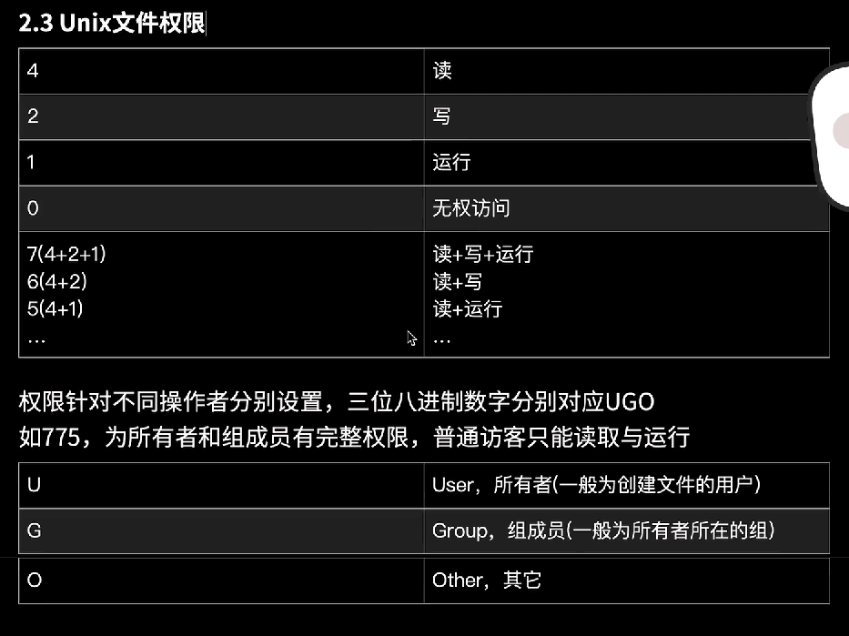
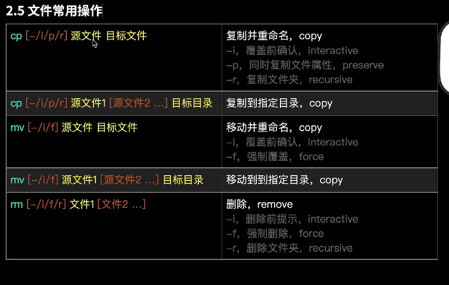

# 命令行命令学习
## 一、目录与路径
### 1. 目录
- 目录，directory,dir
- 工作目录/当前目录，用“.”表示
    - **pwd** print working directory，Windows cmd不可用powershell可用（下面Windows指powershell
- 子目录，目录内的下层目录
    - **ls**,list 查看目录内容列表
- 父目录，目录的上层目录，用“..”表示
- 根目录/顶层目录，用“/”表示
- 主目录/当前用户的用户目录，用“~”
### 2.路径
- 分隔符“/”，分割不同层级目录的符号
- 绝对路径，从根目录出发的路径
    - Windows下为从盘符出发的路径，如“c：”
    - 类Unix下表示根目录的"/"可以省略，如“//user/test”为“/user/test”
- 相对路径，从工作目录出发的路径
    - 一般以“.”或“..”开始
    - “./”可以省略
### 3.更换目录change directory
- **cd 目标目录路径**，由上 “‘./z’可以省略”知，进入当前目录的下层目录是“**cd 直接是目录名**”

## 二、命令参数
- 1、命令后面可以带参数，**命令 参数1 参数2**，用空格分隔多个参数，若参数有SP则要加引号
  - 参数分有无flag，flag前加“-”或“--”，一些flag可以组合使用，本文中除仅支持“--”flag的命令外，默认用“-”
  - 有flag但不带参数，如
      - mkdir 123 456
      - ls [-a/ -l]windows不支持[ 目录路径 ]
          - -a，all 列出所有文件（包括隐藏的）
          - -l，long format，以长格式列出详细信息，Windows的dir默认是以长格式列出详细信息，且不支持-a、-l
          - 组合使用ls -al
  - 有flag带参数，如文件夹的一些操作。
- 2、Unix文件权限

  

- 3、文件夹相关操作
  - 新建文件夹，make directory
  - mkdir[-m UGOwindows不支持/p][路径]文件夹名 字
     - -m，mode配置权限，默认为751
    - -p，parent，如果路径的父级文件夹不存在，会同父级文件夹一同创建
      - 组合使用时，被创建的父级文件夹是默认权限
      - mkdir -m 777 1，“777是三个权限，1是目录名”   
      - mkdir -p abc/efg
    - Windows也支持md
  - 删除文件夹，remove directory
  - rmdir[路径]文件夹名
  
- 4、文件的常用操作
 
  
    

    

